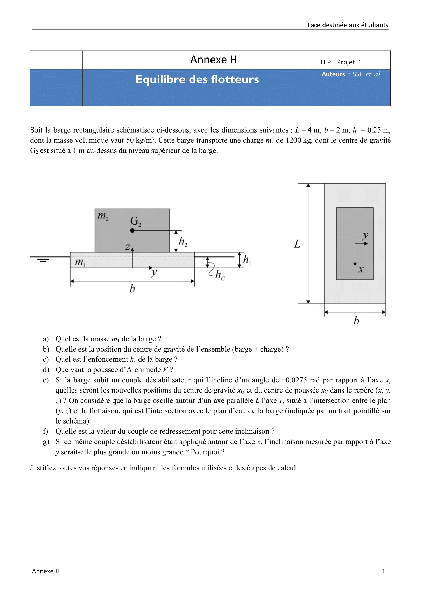
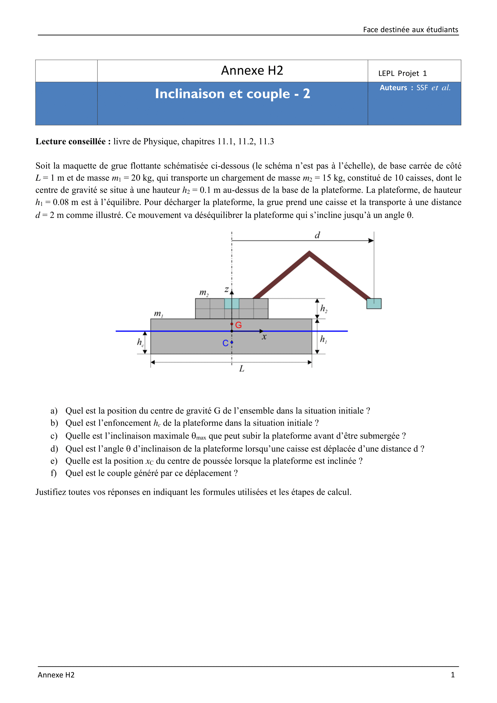

# Execrices de physique
Les programmes pythons ci-dessus traitent de la résolution des exercices présentés ici. Ces programmes servent à **caluler** des valaurs numériques.
Ils sont basé sur les connaisance du groupe et sur certaines hypothèses détaillées ici.

## L'exercices H1
### Énoncé

## L'exercice H2
### Énoncé

##### center_thrust()
Pour une meilleur compréhension de la fonction 'center_thrust()' qui calcule les coordonnées sur centre de gravité d'un trapèze, il peut être utile d'avoir ce shéma sous les yeux. Les variables indiquées ici corespondent à celles utilisées dans le code de la fonction.
